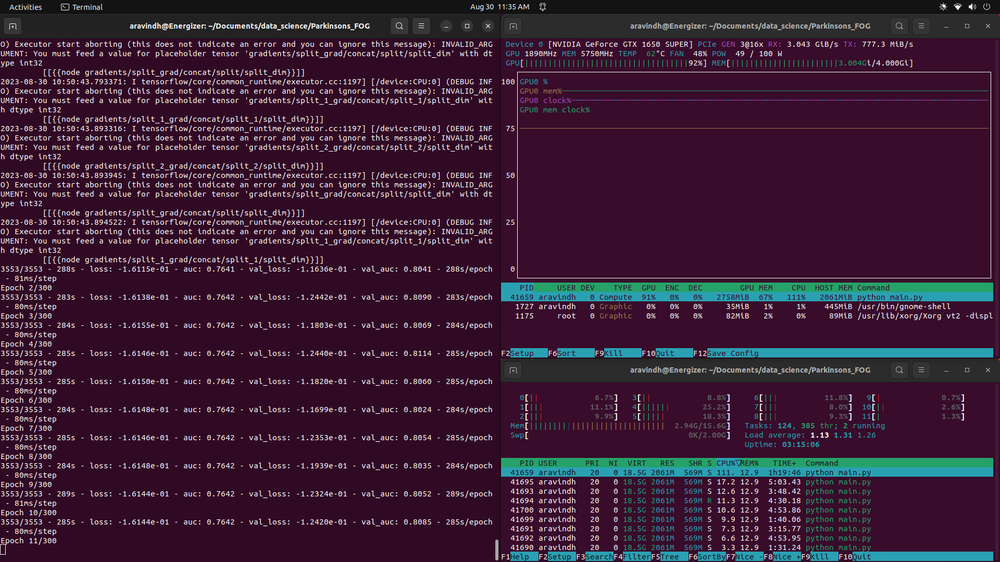
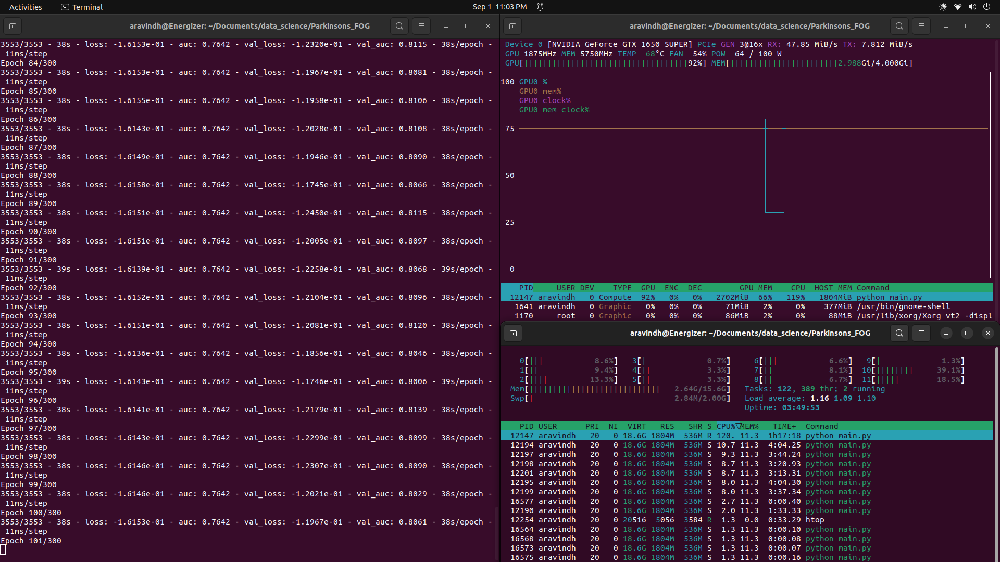

# Freezing of Gait Prediction System

A comprehensive system for predicting freezing of gait (FoG) using machine learning models and enabling real-time
predictions through gRPC and WebSocket streaming.

## DATA:

This is a data that has been taken from Kaggle. It is from [Parkinson's Freezing of Gait Prediction](https://www.kaggle.com/competitions/tlvmc-parkinsons-freezing-gait-prediction/overview).
It consists of two Main Categories of data one 
- **tdcsfog:** It is data that has been collected from patient's activity being monitored in lab condition.
- **defog:** It is data that has been collected from patient's activity being monitored in their homes.

## MODEL ARCHITECTUREs:

There are 2 main Types of models used, **CNN** and **RNN**. The **CNN** model is based on timeseries analysis of 
data in timeframe windows. But whereas the **RNN** Model's approach is to find the **Power Spectrum's** of each column
in a given timeframe window. The Combination of both the data and model types provides a combination of four models.

## MODEL TRAINING RAM USAGE:

Usage of TFRecords instead of the usual way helped in training the model on a large amount of data with low 
ram consumption. TFRecords also improved the performance of Model Training. The above was achievable as TFRecord 
parse individually records in the data file and load it directly into the GPU Memory.

- RAM: 1.28GB—2.01GB
- VRAM: 2.64GB—2.69GB

### TDCSFOG TRAINING PERFORMANCE:

#### RNN


#### CNN


### DEFOG TRAINING PERFORMANCE:

#### RNN



#### CNN



## Table of Contents

- Documentation
    - APIs
        - Explore the API documentation for detailed usage instructions:
            - [pdoc](docs/api/app/index.md)
            - Swagger: run the **api_main.py** using uvicorn from the project root folder and access this
              link: http://localhost:8080/docs.
            - ReDoc: run the **api_main.py** using uvicorn from the project root folder and access this
              link: http://localhost:8080/redocs.

    - [API Main file](docs/api_main.md)
    - [gRPC Stream](docs/grpc_stream/index.md)
    - [Logger](docs/logger_config/log_config.md)
    - [Main file](docs/main.md)
    - [Source](docs/src/index.md)
    - [Streamlit APP](docs/streamlit_app/index.md)
    - [Streamlit Main file](docs/streamlit_main.md)
    - [Testing](docs/tests/index.md)
- [License](LICENSE)
- Contact
    - [Email](mailto:aravindh.p201.741@gmail.com).
    - [LinkedIn](https://www.linkedin.com/in/aravindh-pandiyan-80b983145)

## Introduction

The Freezing of Gait Prediction System is designed to predict the occurrence of freezing of gait (FoG) using machine
learning models. It provides different components for model construction, training, testing, preprocessing, and
real-time streaming of predictions using gRPC and WebSocket.

## Features

- Load different types of machine learning models for FoG prediction.
- Build and train models using both recurrent neural networks (RNN) and convolutional neural networks (CNN).
- Preprocess input data and convert it into suitable formats for training.
- Test the trained models using various metrics to assess their performance.
- Stream real-time predictions using gRPC and WebSocket protocols.
- Interactive API documentation using Swagger and pdoc.
- The APIs can be run individually without the UI services.

## Installation

### Clone the repository:

   ```bash
   git clone https://github.com/AravindhPandiyan/Parkinsons_FOG.git
   cd Parkinsons_FOG
   ```

### Project Setup:

   ```bash
   make setup
   ```

## Running Project

### Activate Poetry:

   ```bash
   make activate
   ```

### Running Project from the Main file:

   ```bash
   pythom main.py
   ```

## View Model Logs

### Activate Poetry:

   ```bash
   tensorboard --logdir logs/TensorBoard
   ```

## Running Project using docker containers

### Build docker container using:

   ```bash
   docker compose build
   ```

or

### Pull docker container using:

   ```bash
   docker compose pull
   ```

--------------------------------

### Run the docker containers:

   ```bash
   docker compose up
   ```

or to run the containers in detached mode

   ```bash
   docker compose up -d
   ```

## Running APIs without the UI services

### Running using python:

   ```bash
   pythom api_main.py
   ```

### Running as a linux service:

- Replace all the given tags in the api.service file and make sure it is pointing to the project file and environment.
- move the api.service file to /etc/systemd/system/ folder.
- Then follow the bellow commands:

#### Reload the service daemon:

   ```bash
   systemctl daemon-reload
   ```

#### Start the api service:

   ```bash
   systemctl start api.service
   ```

#### To set the service to auto-start when the system powers on:

   ```bash
   systemctl enable api.service
   ```

#### To check the status of the service:

   ```bash
   systemctl status api.service
   ```
